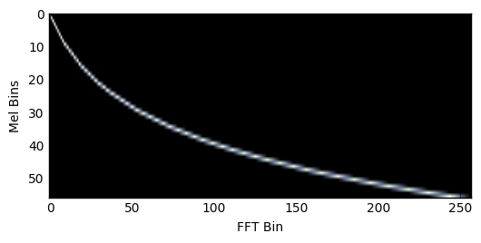

# Feature Extraction

This folder gives examples of using spectrograms and mfcc's, in order to do the necessary processing.

## Spectrogram Features
The basis of many of the algorithms is the short time Fourier transform (STFT). These functions have been implemented.

## Mel Frequency Cepstral Coefficients
These are defined as:

$$\mathbf{C} = \mathcal{DCT} \left\{ \Phi \log |\mathcal{DFT}(\hat\mathbf{x})|   \right\} $$

## Including iterators in this directory, of which we have:

[`hdf5_iterator`](hdf5_iterator.py) - Parses through HDF5s
