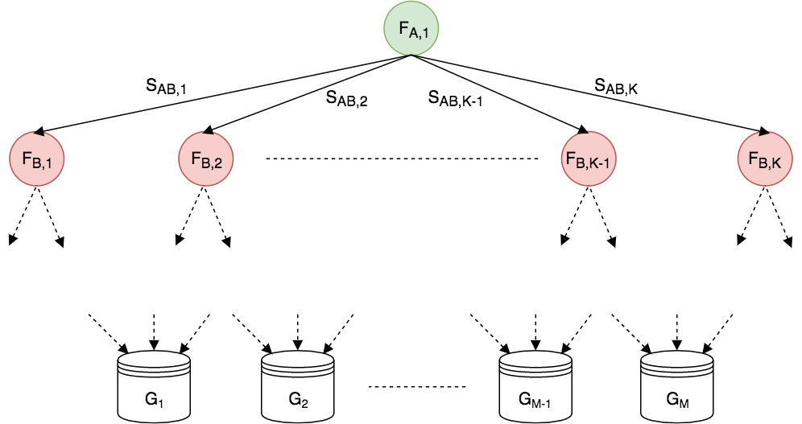
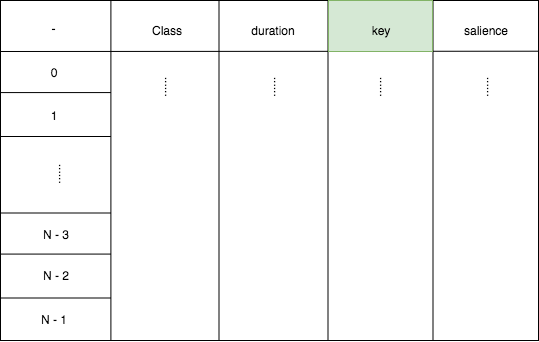
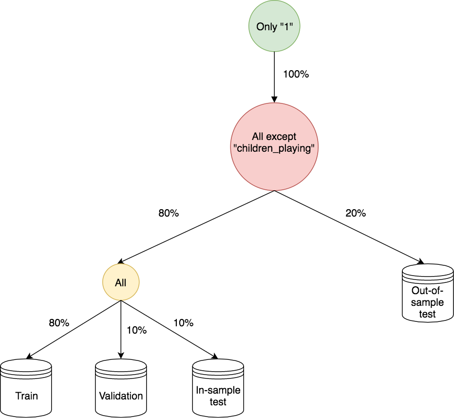

# Data Iteration

This folder contains the algorithms responsible for partitioning the data,
iterating over those partitions, and mixing different sources of audio.

## Data Partitioning

Partitioning of a preprocessed data file into various sets is accomplished
through the `partition_data.py` script.
This script takes as arguments a preprocessing settings file, logging
configuration file, and logger name.
Argument names can be displayed by running the script with the `--help` or `-h`
flag.
The most pertinent argument is the partition settings JSON file; a template
of which can be found in `magnolia/settings/partition_template.json`.
The structure of the JSON file is as follows:

```javascript
{
  "metadata_file": "...", // location of csv metadata file used to partition data
  "output_directory": "...", // output directory where .txt are to be stored
  "description": "...", // textual description of partitions
  "rng_seed": null, // random number seed (for reproducibility)
  "partition_graphs_file": "..." // file containing the partition graph
}
```

The `metadata_file` is the location of the CSV file containing the metadata used
for partitioning the data.
The `output_directory` will contain the results of the partitioning in the form
of sub-directories and CSV files each of which contain a list of HDF5 `Dataset`s
that belong to that group.
The `description` is an optional plain text description of how the data is
partition.
This is useful for describing the intent for the `partition_graphs`.
The `partition_graphs` is a specially-formatted portion of the settings that
fully specifies how the input file is partitioned.
Finally, the `rng_seed` is an integer seed used to initialize the random number
generator.

### The partition graph

The partition graph is a graphical representation of how to partition a
data table where each entry in the table conceptually represents a unique data
sample.
It is a directed, acyclic graph where each node specifies how to filter the
table (i.e. a Pandas `query`) and the edges specify the proportion of the parent
node to pass along to the next node.
The proportion of the parent node to pass along an edge may be grouped along
categories in column of the table or over all samples.
The terminating nodes of the graph (or leaves on a tree) are the mutually
exclusive groups of data samples.
A generic table is given below that will aid in the following discussion.


Here, the number of samples is $N$ while the number of columns is $M$.
The column that contains the unique, identifying information regarding each
individual sample within an HDF5 file is highlight in green and denoted $L_K$.

Generally speaking, to partition a dataset, only a three operations are
possible:
* Filtering through queries
* Random splitting (on either categories or samples)
* Assign to groups the results of filtering and splitting

If a column contains categorical values, these columns could be split
proportionally to the number of samples within those categories.
Conceptually, the whole dataset is only ever filtered and split until what
remains is stored in groups.
This is abstractly shown in the following diagram.



Each node here represents a filter ($F$) that performs a specified query on the
(portion of the) dataset while the edges are the fractions of the samples or
categories labels being passed along to the next node.
The final dataset portions are stored in one or more groups ($G$) and saved to
disk in the form of CSV files.
It's important to note that the fractions associated with the edges emanating
from a node can sum to any number less than or equal to 1.0.

To make this more concrete, the following is the metadata for the UrbanSound8K
dataset.



Here, the `key` column specifies the exact path within the HDF5 file where to
find each sample.
Suppose the following partitioning is desired: Select a salience of 1, remove
the "children_playing" noise class, reserve 10% of the remaining noise `Class`es
for out-of-sample testing, and, finally, make an 80/10/10 train/validation/test
split of the remaining 90%.
This is what is diagramed in the following partition graph.



Here, the two test groups have different names, but in general they could've
been named the same for a single test group.
The first node in the graph represents the filter/query on the `salience` and
`Class` categories and the `duration` values.
A split is then applied to the `Class` category such that 10% of this category
(weighted by sample population) are sent to the `Out-of-sample test` group while
the other 90% of the categories are sent to a filter that allows all data to
pass.
The samples are then sent through a 80/10/10 split into the `Train`,
`Validation`, and `In-sample test` groups.

#### How the split is determined

The proportion specified along each edge is only approximately followed if
it is a split along a category as categories are discrete.
Print outs of the specified and actual tree structures are given after the
partitioning is finished.

#### Partition graph JSON structure

The corresponding JSON to specify the UrbanSound8K partition graph previously
diagramed is given below.

```javascript
{
  "partition_graphs": [
    {
      "data_label": "key",
      "filters": [
        {
          "id": "time_volume_interference",
          "pandas_query": "salience == 1 & duration >= 2 & Class != \"children_playing\""
        },
        {
          "id": "training_set"
        }
      ],
      "groups": ["out_of_sample_test", "in_sample_test", "validation", "train"],
      "splits": [
        {
          "source": "time_volume_interference",
          "target": "out_of_sample_test",
          "split_on": "Class",
          "fraction": 0.1
        },
        {
          "source": "time_volume_interference",
          "target": "training_set",
          "split_on": "Class",
          "fraction": 0.9
        },
        {
          "source": "training_set",
          "target": "in_sample_test",
          "fraction": 0.1
        },
        {
          "source": "training_set",
          "target": "train",
          "fraction": 0.8
        },
        {
          "source": "training_set",
          "target": "validation",
          "fraction": 0.1
        }
      ]
    }
  ]
}
```

Each `filter` can have the following attributes (default is to include all
categories):
* `id`: name of the filter that is referenced by the splits and serves as the
  directory name during storage (required)
* `pandas_query`: valid Pandas query string (optional)

Each `group` only has a name.

Each `split` has the following attributes:
* `source`: `id` of a `filter`
* `target`: `id` of a `filter` or name of a `group`
* `split_on`: category to split along (optional)
* `fraction`: split fraction of categories or samples


## Mixing

Different mixing schemes are used for speaker-speaker versus speaker-noise.

For speaker-speaker mixing ...

For speaker-noise mixing tables identifying the speaker clip, noise clip,
start time, stop time, and various multiplicative factors indicating how to
scale the speech to a certain dB level are given.


## Iteration
