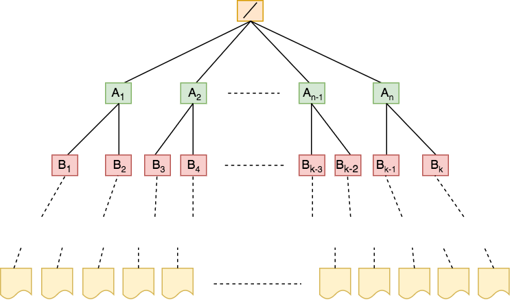
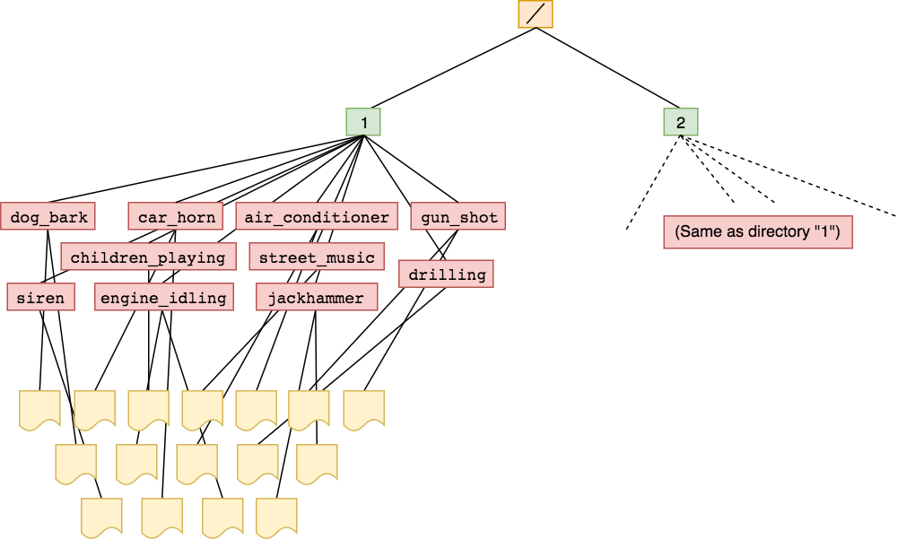

# Data Iteration

This folder contains the algorithms responsible for partitioning the data,
iterating over those partitions, and mixing different sources of audio.

## Data Partitioning

Partitioning of a preprocessed data file into various sets is accomplished
through the `partition_data.py` script.
This script takes as arguments a preprocessing settings file, logging
configuration file, and logger name.
Argument names can be displayed by running the script with the `--help` or `-h`
flag.
The most pertinent argument is the partition settings JSON file; a template
of which can be found in `magnolia/settings/partition_template.json`.
The structure of the JSON file is as follows:

```javascript
{
  "data_file": "...", // HDF5 file to partition
  "output_directory": "...", // output directory where .txt are to be stored
  "description": "...", // textual description of partitions
  "partition_graph": { // (described later)
    "filter": {}
  }
}
```

The `output_directory` will contain the results of the partitioning in the form
of text files each of which contain a list of HDF5 `Dataset`s that belong to
that group.
The `description` is an optional plain text description of how the data is
partition.
This is useful for describing the intent for the `partition_graph`.
The `partition_graph` is a specially-formatted portion of the settings that
fully specifies how the input file is partitioned.

### The partition graph






The fractions associated with the edges emanating from a node needn't sum to 1.
The hierarchical structure of the HDF5 file needn't have files only located at
one level.

## Iteration
